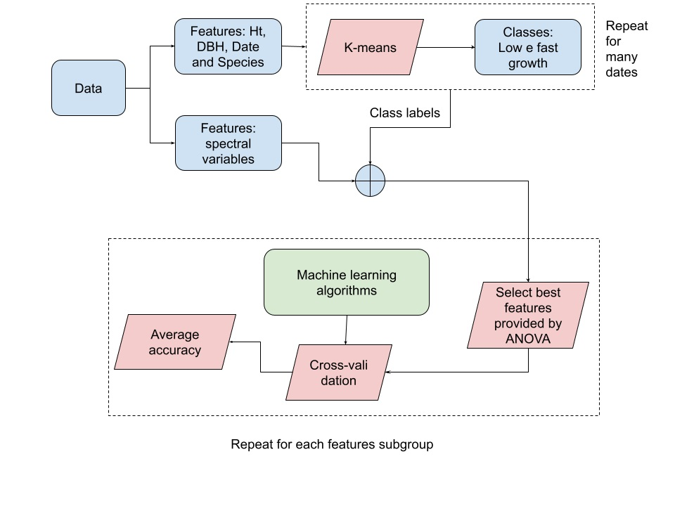

# Eucalyptus growth recognition using machine learning methods and spectral variables

<b>This research was published in the journal Forest Ecology and Management with the title above. It was carried out as part of the post-ductorship at the Federal University of Mato Grosso do Sul (UFMS) at the Chapadão do Sul Campus. The orientation was carried out by Professor Paulo Eduardo Teodoro (https://orcid.org/0000-0002-8236-542X). </b>

<b>Please, if you use the source codes provided here or the ideas explored in the article, please give us the proper citation, through: https://www.sciencedirect.com/science/article/abs/pii/S0378112721005867 or https://doi.org/10.1016/j.foreco.2021.119496</b>

Abstract: Growth and production models can help to simulate the growth of tree dimensions to predict forest productivity at different levels. In this context, the following questions arise: (i) is it possible to recognize the growth pattern of eucalyptus species based on spectral features using machine learning (ML) for data modeling? (ii) what spectral features provides better accuracy? and (iii) what ML algorithms are most accurate for performing this modeling? To answer these questions, the present study evaluated the use of ML techniques using breast height and total plant height to classify the growth of five species of eucalyptus and Corymbria citriodora in an unsupervised learning, and the obtained classes for induce ML algorithms to recognize the species with relation to their growth using vegetation indices (VIs) and spectral bands (SBs). It were evaluated five eucalyptus species (E. camaldulensis, E. uroplylla, E. saligna, E. grandis e E. urograndis) and C. citriodora in experimental design of randomized blocks with four replicates, with 20 plants inside each experimental plot. The diameter at breast height and total plant height at stand level were obtained by measuring five trees in each experimental unit in seven measurements. During this same period, a flight was carried out using a remotely piloted aircraft for the acquisition of spectral variables (SBs and VIs). For recognition of eucalyptus species in relation to their growth two machine learning approaches were employed: supervised and unsupervised. The average accuracy obtained from 10-fold cross-validation, employing Random Forest algorithm and 24 features, was 0.76. This result shows that the proposed approach is appropriate to recognize different eucalyptus species based on their growth.

Block diagram of the proposed approach

